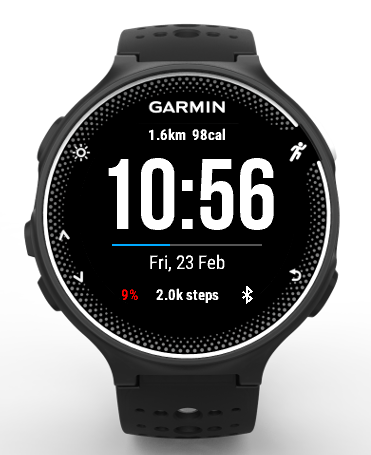

# Watch-Face-Garmin

Basic watch face for the Garmin Forerunner 230/235 watches, forked from https://github.com/laurencee9/Watch-Face-Garmin

### Changes
* Adding support for 12/24 hour clock.
* Bigger clock numbers.
* Battery stat only shows if < 10%, else show notification count.
* Distance and calorie count displayed on top.
* Sixtop.net branding when no step activity is detected.

### Preview with 24-hour clock, critical battery and half full activity bar:

*This project is licensed under the terms of the MIT license.*
